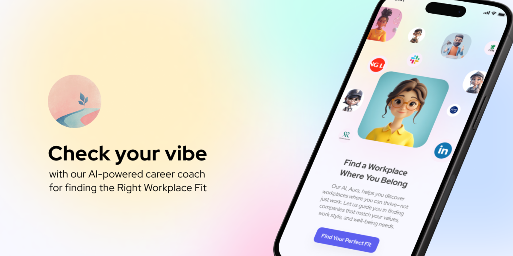

<a href="https://vibecheck.dev/">
  
  <h1 align="center">Vibe Check</h1>
</a>

<p align="center">
  No more career blind dates - meet jobs that 'get' you from day one. Connecting people with workplaces that feel right—where employees thrive, and employers attract lasting talent.
</p>

## Pitch

[Video](https://youtu.be/vBOXliBXrA8)  
[Slides](https://docs.google.com/presentation/d/14vsgkPJlyKA06O7OVZztcjsQqkOV9-sm/edit?usp=sharing&ouid=103685890722722422594&rtpof=true&sd=true)
[Figma](https://www.figma.com/design/Zqq68i345KwB7559B1B2hb/Junction-2024?node-id=21-3501&t=nObsHiWkxFQpBB8D-1)
[FigJam](https://www.figma.com/board/cfPpfBSSi3Sgui8SmHI5oA/Junction-2024?node-id=150-557&t=Z35z4PcjmYuSREVh-1)

## Problem it Solves:

In today’s fast-paced work environment, there’s often a gap between what employees need for fulfillment and what companies actually offer in terms of culture and values. Statistics reveal that nearly 30% of new hires leave within the first 90 days due to poor cultural fit, while over 70% of employees feel unfulfilled at work. This misalignment isn’t just costly for companies—wasting up to 30% of an employee’s first-year earnings on turnover expenses—it also impacts employee well-being and productivity. Vibe Check addresses this by providing a transparent, data-driven approach to matching candidates with workplaces that truly align with their values and needs, enabling informed choices for both employees and employers.

## Real-World Impact:

Vibe Check has the potential to reshape hiring by making cultural alignment and well-being core priorities. For employees, this means finding workplaces where their values are embraced, their well-being is prioritized, and personal growth is encouraged, leading to greater job satisfaction and less turnover. For employers, it means attracting and retaining people who thrive within their culture, building stronger, more engaged teams. By highlighting alignment in values, work styles, and well-being needs, Vibe Check helps create a workforce that’s not only productive but genuinely connected to their work.

## Technologies Used:

- Frontend Development: NextJS and React.js for a smooth, responsive experience.
- Styling: Tailwind CSS, making the design flexible and user-friendly.
- AI & Backend Integration: OpenAI Assistants and ChatGPT for AI-driven insights and personalized coaching, guiding users to the right match.
- Programming: TypeScript, ensuring scalable, efficient code.
- Design and Creativity Tools: Figma and Canva for UI/UX design, with Capcut for video content.
- Data Management: Excel for structuring and analyzing data.
- Deployment & Hosting: Vercel for reliable performance and scalability.

## Future Plans:

Benefits Comparison: Enable candidates to easily compare benefits like mental health support, flexibility, and work-life balance across companies, helping them make decisions that support their well-being.
Wellness Integration: Partner with wellness providers, giving employers insights into well-being and offering candidates access to wellness resources.
Employer Engagement Analytics: Provide companies with data on candidate interactions (views, saves, applications) to refine their cultural messaging and enhance candidate attraction.

## Conclusion:

Vibe Check is designed to bridge the gap between workplace reality and employee expectations, fostering a hiring process rooted in values and transparency. With tools like the Vocational Meaning and Fulfillment Survey (VMFS), Vibe Check brings alignment to the forefront, connecting people and workplaces where they can truly thrive.

## Running locally

You will need to use the environment variables [defined in `.env.example`](.env.example) to run Vibe Check. It's recommended you use [Vercel Environment Variables](https://vercel.com/docs/projects/environment-variables) for this, but a `.env` file is all that is necessary.

> Note: You should not commit your `.env` file or it will expose secrets that will allow others to control access to your various OpenAI and authentication provider accounts.

1. Install Vercel CLI: `npm i -g vercel`
2. Link local instance with Vercel and GitHub accounts (creates `.vercel` directory): `vercel link`
3. Download your environment variables: `vercel env pull`

```bash
pnpm install
pnpm dev
```

Your app template should now be running on [localhost:3000](http://localhost:3000/).
